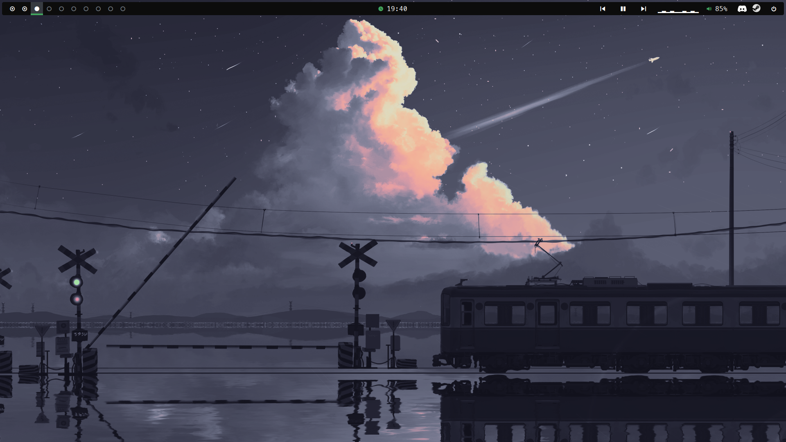

# Mis dotfiles 

    

Configuración personal para Debian (Linux Mint) basada en BSPWM.

Incluye instalación automática de:

- BSPWM
- SXHKD
- Polybar
- Picom (compilado desde git)
- Kitty
- Rofi
- Dunst
- Zsh

### El escritorio en acción

https://github.com/user-attachments/assets/110cd66a-7894-4df5-b346-6c74c640e9ac

https://github.com/user-attachments/assets/4a20591e-53ff-4972-af22-20c4f8bcca3c

## Instalación

    git clone https://github.com/muru666/dotfiles.git

    cd dotfiles

    chmod +x install.sh

    ./install.sh

## Atajos relevantes
Todos los atajos están referenciados en sxhkdrc

Super = Tecla de Windows

Super + D
    Menú de aplicaciones
Super + I / O
    Enforcar aplicación anterior / Siguiente

Super + W
    Cerrar ventana

Super + (Flechas)
    Seleccionar terminal

Super + shift + (Flechas)
    Mover ventana

Super + M
    Ventana maximizada

Super + T/S/F
    Modo tiling / Ventana flotante / Ventana completa

Super + Control + (Flechas)
    Reducir tamaño de la ventana (Hecho para ventana flotante)

Super + Alt + (Flechas)
    Aumentar tamaño de la ventana

Super + B
    Abrir Brave

Super + Alt + R / Q
    Reinicia / Cierra BSPWM 

Super + Escape
    Actualiza los atajos (ver sxhkdrc)